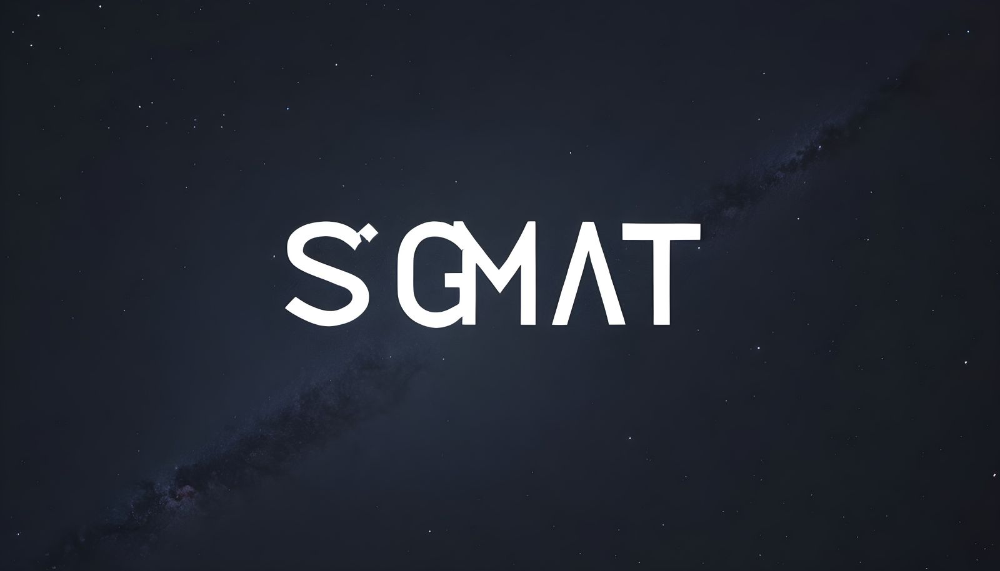

# Sigma-Tau Blog

Este repositorio es una amplia colección de artículos que exploran diversos temas relacionados con la programación y la educación. Su objetivo es compartir publicaciones que abarcan desde el aprendizaje de programación hasta otros temas educativos relevantes. Los artículos están disponibles tanto en español como en inglés, ofreciendo así un recurso inclusivo y accesible para una audiencia diversa."
